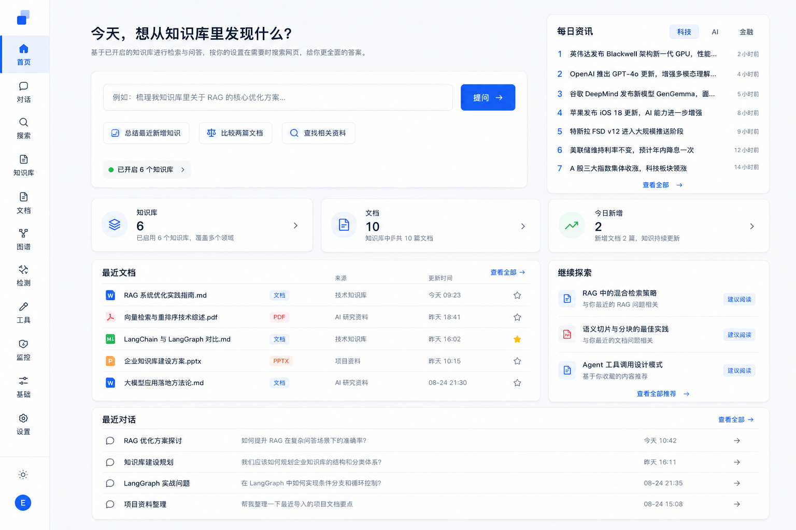

# 知域

个人 AI 助手：用你自己的资料回答问题、做研究与规划——知识库是底座，助手是入口。

支持 RAG 问答、ReAct Agent（工具调用）、出行规划预订、AI 资讯与知识洞察。

<p align="center">
  
</p>

<p align="center">
  <em>首页：统一提问入口；助手基于已开启的知识库检索与作答</em>
</p>

代码仓库名：`knowledge_realm`  
身份只来自 Session，数据按用户隔离。

## 功能概览

| 模块 | 能力 |
|---|---|
| 助手对话 | 首页/对话统一提问；RAG 流式回答与来源引用；多轮会话 |
| Agent | 单链问答、知识编排、ReAct 多工具 Agent、研究报告；Tool Calling、证据充分性与会话记忆 |
| 出行助手 | 行程规划与预订（人工确认）；工具页「我的行程单」 |
| 知识库与文档 | 多知识库；PDF / Word / Markdown / TXT / URL / 手写笔记；处理状态、收藏、标签、重新处理 |
| 检索 | 向量语义搜索；可选混合检索（BM25 + 重排）；按库 / 标签 / 类型筛选 |
| 知识增强 | 自动摘要与标签；实体关系；相关文档；多文档对比 |
| AI 资讯 | 今日热榜与详情；定时任务刷新 RSS 排行 |
| 知识洞察 | 冲突检测、缺口分析、自动整理（报告型） |
| 版本与刷新 | 文档版本；URL 手动 / 批量刷新与增量索引 |
| 其它 | 首页推荐；侧栏菜单管理；调试页（检索 / Agent 轨迹 / Token）；监控占位（决策审计 / 操作审计） |

## 技术栈

- 后端：FastAPI、SQLAlchemy、Alembic；问答用 LangChain；Agent 用 LangGraph（标准 Tool Calling）
- 数据库：PostgreSQL + pgvector（库名 `knowledge`），一张 `document_chunk` 表
- 解析：PyMuPDF、python-docx、trafilatura（公开 URL）；无 OCR
- LLM / Embedding：阿里云 DashScope 兼容接口（`openai` / `langchain-openai` 仅作客户端）
- 任务：短任务 BackgroundTasks；定时任务 APScheduler + Redis + arq Worker
- 可选：Elasticsearch（BM25）；MinIO（行程方案页）
- 前端：Vue 3 + TypeScript + Vite（`web/`）
- 部署：Docker Compose 或本机 venv + npm

## 快速部署

**前提**：已安装 [Docker](https://docs.docker.com/get-docker/) 与 Docker Compose。

```bash
git clone https://gitee.com/echola/knowledge.git
cd knowledge
# 或：git clone git@github.com:echola-mendes/knowledge-realm.git && cd knowledge-realm

cp .env.docker.example .env
# 编辑 .env：填写 LLM_API_KEY、SESSION_SECRET（≥32 字符）、INITIAL_PASSWORD
./scripts/deploy.sh
```

浏览器打开 `http://localhost:8080`（端口可在 `.env` 的 `HTTP_PORT` 修改）。

```bash
docker compose logs -f api worker   # 日志
docker compose down                 # 停止
docker compose up -d --build        # 更新后重建
```

Compose 拉起 Postgres（pgvector）+ Redis + API + Worker + Nginx；数据库迁移在 API 启动时自动执行。

## 本机运行

### 1. 数据库

本机 PostgreSQL 建库并启用扩展：

```sql
CREATE DATABASE knowledge;
\c knowledge
CREATE EXTENSION IF NOT EXISTS vector;
```

### 2. 环境变量

```bash
cp .env.example .env
```

必填：`DATABASE_URL`（`postgresql+psycopg://用户名:密码@127.0.0.1:5432/knowledge`）、DashScope API Key（[百炼控制台](https://bailian.console.aliyun.com/)）、`SESSION_SECRET`、`INITIAL_PASSWORD`。

定时任务还需本机 Redis（默认 `REDIS_URL=redis://127.0.0.1:6379/0`）。混合检索可选配 `ELASTICSEARCH_URL`；行程方案上传可选配 MinIO。

### 3. 后端

```bash
cd server
python3.12 -m venv .venv
source .venv/bin/activate
pip install -r requirements.txt
alembic upgrade head
uvicorn app.main:app --host 127.0.0.1 --port 8000 --app-dir .
```

健康检查：`GET http://127.0.0.1:8000/health`

定时任务 Worker（独立进程，消费资讯刷新等）：

```bash
cd server
source .venv/bin/activate
python -m app.worker.worker
```

### 4. 前端

```bash
cd web
npm install
npm run dev
```

打开 `http://127.0.0.1:5173/`（开发时 `/api` 代理到 8000）。

### 5. 测试

```bash
cd server
pytest -q
```

`.env` 不要提交。默认 Embedding：`text-embedding-v3`，维数 1024。
