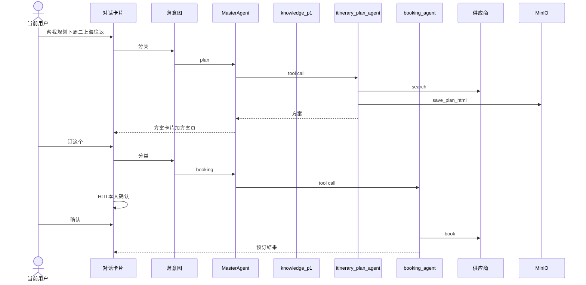

# P4（第一批）——个人出行 Agent（规划 / 定制方案 / 搜订机酒）

**状态：** 需求已按 `docs/multi-agent/PRD-GO.md` 链路 **C/D** 裁成个人出行（B 的审批降为**本人 HITL 确认**、并入 D），*
*待提出人批准后开始**；本批**不写入** `implementation-plan.md`，实施规格以本文为准。  
**已拍板：**

- 审批 = 当前用户本人 HITL
- MinIO 持久化：**行程方案页** + **`task=report` 知识报告**（软依赖；key 前缀分离）
- **统一入口**：`/api/agent`（及 stream）→ **薄意图** → **Master（Supervisor）** → 子能力
- 多 Agent 模式 = **Supervisor + Agents-as-Tools**（子 Agent 当工具，互不发消息）
- 意图识别 ≠ Master：两段串联；本批意图 = **一次结构化分类**（不上 L1/L2/L3）
- 本批 **3 个子能力**：`knowledge`（现有 p1）/ `itinerary_plan_agent` / `booking_agent`；不做独立 manage/info
- Hook 本批必做：**SSE 进度/方案页** + **预订落库**；其余后置

**基线：** P0 / P1.1–P1.4 / P2 已收口；P3 第一批按 `PRD-P3.md` 并行或先后，互不阻塞本批设计。  
**蓝本：** `PRD-GO.md`（gogo-agent）。知域**按业务需求重建**，不是服务化集成 gogo；栈为现有 FastAPI + LangGraph。

## 1. 版本目标

本批做三件事（当前 Session 个人用户，对话内完成）：

1. **规划旅游行程**：按日期/出发地/目的地搜索机票、酒店，给出可比方案；方案页 SSE 实时推送，并写入 MinIO 供历史回看。
2. **定制专属出游方案**：按用户口头偏好（预算、舱位、时段等）调整方案；已有 `user_memory` 可注入，不接百炼。
3. **搜索并预订机票和酒店**：用户本人 HITL 确认后下单，落本人预订记录，返回支付链接（若供应商提供）。

**对照 `PRD-GO.md`：做 / 删**

| GO 链路 / 能力                              | 知域 P4                                                        |
|-----------------------------------------|--------------------------------------------------------------|
| **多 Agent 骨架**（Master 路由 + 子 Agent 作工具） | **做**：Supervisor + Agents-as-Tools；薄意图 → Master              |
| **统一入口**                                | **做**：仅 `/api/agent`（及 stream）；现有 `p1` 降为知识子能力               |
| **C 行程规划**                              | **做**（`itinerary_plan_agent`）；火车票本批不做                        |
| **C 方案页 MinIO**                         | **做**（软依赖）；`plan_html` + `task=report` 报告均落 MinIO，key 前缀分离 |
| **D 预订执行**                              | **做**（`booking_agent`）                                       |
| **A 智能问答（RAG）**                         | **做**：并入 `knowledge`（现有 `p1/graph.py`）；**不**另起 `info_agent`  |
| **A 差旅政策 RAG、职级×城市预算/舱位引擎**             | **删除**                                                       |
| **B 差旅申请 → 内部审批 → 审批页**                 | **删除**（不做 `itinerary_manage_agent`；要素补全并入 plan/booking HITL） |
| **B 差旅单冲突检测**                           | **删除**                                                       |
| **E 报销**                                | **删除**                                                       |
| 钉钉/企微、EasyNextAdmin、企业角色                | **删除**                                                       |
| 三层意图（L1/L2/L3）+ 查询改写                    | **本批不做**（一次结构化意图即可）                                          |
| 百炼记忆                                      | **不用**（记忆用现有 LTM / `user_memory`）                            |
| Redis                                       | **可用**（熔断/缓存/限流/多实例广播等；会话 Checkpoint 仍以 Postgres 为主）       |
| 横切 Hook                                 | 本批必做 SSE + 预订落库；熔断/压缩等后置                                     |

---

## 2. 统一约束

- **身份只来自 Session**；禁止请求参数指定 `user_id`。预订/查询/取消只作用于当前用户。`users` 不扩展企业字段，不做 RBAC。
- **统一入口**：`/api/chat` 不改；Agent 模式只走 `/api/agent` / `/api/agent/stream`。请求路径：**薄意图节点 → Master → 子能力
  **。禁止并行第二条 travel API。
- **意图 ≠ Master**：意图只输出标签（如 `knowledge` \| `plan` \| `booking` \| `chat`）；Master 只按标签调度并整合，禁止再做一套完整意图识别。寒暄/
  `chat` 可由 Master 直接回复。
- **多 Agent**：Master 将 3 个子能力注册为工具（同进程）；`forwardEvents(false)` 语义（子事件不冒泡打乱前端）。子能力之间不互发消息。
- **与现有 p1**：`p1/graph.py` 作为 **`knowledge` 子能力**挂入 Master，不是与 Master 并存的第二入口。`task=report` 生成报告后可**写入 MinIO**（`reports/...`），与行程方案页 key 分离；`/api/chat` 入口行为可保留，存储走 MinIO 软依赖。
- **搜索/出方案**：只读，不强制 HITL。**下单/取消预订**：强制 HITL（本人确认）。模型不得自主下单。
- 供应商 Key 只存 `.env` 或用户本人加密存储（实施时择一）。保留 **flyai 免 Key trial** 作机票备源。
- **行程方案页**：SSE/`plan_html` 实时渲染 + `save_plan_html` 上传 MinIO（软依赖）。对象 key 建议 `plans/{conversation_id}/...`。
- **知识报告**：`task=report` 完成后上传 MinIO（软依赖）。对象 key 建议 `reports/{conversation_id}/...`，与方案页前缀分离。
- 无 Celery；预订落现有 Postgres。Redis **可用**（限流/熔断缓存/多实例广播等，非主链路硬依赖）。HITL（`pending_action` + 确认卡片）为本批新增。

---

## 3. 总体架构

### 3.1 模式与链路

**模式：** Supervisor（Master）+ Agents-as-Tools。

```
用户消息（Session）
  │  /api/agent(/stream)
  ▼
薄意图（一次结构化：knowledge | plan | booking | chat）
  ▼
MasterAgent（Supervisor：按标签调度 + 整合）
  ├── knowledge          → 现有 p1/graph.py（RAG/WEB 等知识问答）
  ├── itinerary_plan_agent → 搜机/酒、plan_itinerary、save_plan_html（MinIO+SSE）
  └── booking_agent      → HITL → book_*/cancel_*、list_bookings；落库 booking_record
```

| 子能力       | Tool（本批）                                              | 读写              |
|-----------|-------------------------------------------------------|-----------------|
| knowledge | 沿用 p1 检索/生成路径；`task=report` 可写 MinIO | 只读 + 报告写 MinIO（软） |
| plan      | `search_flights` / `search_hotels` / `plan_itinerary` | 只读              |
| plan      | `save_plan_html`                                      | 写 MinIO（软）+ SSE |
| booking   | `book_flight` / `book_hotel`                          | 写，须 HITL        |
| booking   | `list_bookings` / `cancel_booking`                    | 查只读；取消须 HITL    |

**本批不做独立子 Agent：** `itinerary_manage_agent`、`info_agent`、报销 Agent。



### 3.2 Hook（本批）

Hook = 生命周期拦截器；知域可用等价实现，不必同名 Java 类。

| 本批     | 对齐 gogo                                    | 作用                                 |
|--------|--------------------------------------------|------------------------------------|
| **必做** | `ProgressNotifierHook`                     | SSE：progress、travel_data、plan_html |
| **必做** | `BookingPersistenceHook`                   | 下单/取消写 `booking_record`            |
| **沿用** | 会话持久化                                      | 现有会话/消息表                           |
| **后置** | 熔断、CLI 压缩、Skill 折叠、TTL、中断广播、供应商 Key Hook 等 | 见 GO §6                            |

---

## 4. 阶段一 — 规划与定制（TRAVEL-PLAN-1）

对齐 GO 链路 C；落地为薄意图 + Master + `itinerary_plan_agent`（及 knowledge 挂载不阻塞本阶段）。

### 4.1 能力

- 意图能把「规划/改方案」标为 `plan`；Master 调 plan 子 Agent。
- 收集缺失要素：对话补问；补问/确认卡片为本批新增（text/select/confirm）。
- `search_flights` / `search_hotels`：搜索比价；结果归一化后给前端卡片。
- `plan_itinerary`：至少给出可对比多套方案；口头偏好可改方案且不丢日期/城市。
- `save_plan_html`：SSE + MinIO（`plans/...`）。
- `task=report`：报告生成后上传 MinIO（`reports/...`），与方案页 key 分离。
- 偏好：口头优先；可读 `user_memory`；不接百炼。
- 供应商失败：提示并尝试 flyai；全失败不崩。

### 4.2 本批不做（规划侧）

- 火车票、六维企业审核器、独立「我的行程」菜单页
- 天气/签证 MCP；机票 flyai 必有，酒店最多再加一个源
- 独立 info/manage 子 Agent

### 4.3 验收

- [ ] 「下周二去上海、周四返回，经济舱」→ 意图 `plan` → Master → plan 子 Agent → 方案卡片
- [ ] 改偏好后方案更新，不丢原日期/城市
- [ ] SSE 可见方案页；MinIO 已配可回看；未配时实时可用并提示
- [ ] 无商业 Key 时 flyai trial 或明确备源失败
- [ ] 酒店未配置时提示，不伪造房型
- [ ] `/api/chat` 行为可保留；知识问答复用 `/api/agent` → `knowledge`；`task=report` 可回看 MinIO

---

## 5. 阶段二 — 搜订机酒（TRAVEL-BOOK-1）

对齐 GO 链路 D；落地为 `booking_agent`；确认人是旅客本人。

### 5.1 能力

- 意图 `booking` → Master → booking 子 Agent。
- 预订确认卡片；确认后才 `book_*`；拒绝不下单。
- 成功写 `booking_record`（`user_id, kind=flight|hotel, vendor, external_id, payload, status, created_at`）；透出支付链接（若有）。
- `list_bookings` 仅本人；`cancel_booking` 须 HITL。

### 5.2 HITL（本批新增）

`pending_action`：`tool` / `args` / `summary` / `confirmed`。未确认写操作拦截。前端 Agent 模式 `ChatView` 卡片，样式
`web/style.md`。无 `/approvals` 页。

### 5.3 验收

- [ ] 确认后下单且属当前用户；未确认/拒绝无记录
- [ ] 「我的预订」仅本人；跨用户 404
- [ ] 取消经确认后状态更新
- [ ] 供应商 Key 不出现在前端与仓库明文

---

## 6. 范围汇总

| 做                                            | 不做                             |
|----------------------------------------------|--------------------------------|
| 薄意图 + Master + 3 子能力（knowledge/plan/booking） | 独立 manage/info/报销子 Agent       |
| 机/酒搜索、多方案、口头定制；方案页 SSE + MinIO；`task=report` 报告进 MinIO | 企业差旅单、内部审批、审批页、钉钉/企微           |
| 预订 HITL、本人订单落库/查询/取消                         | 三层意图、百炼记忆、Celery                  |
| Hook：SSE + 预订落库                              | 熔断/压缩等后置 Hook                  |
|                                              | 批准前写入 `implementation-plan.md` |

---

## 7. 实施顺序（本文档内，不进 implementation-plan）

1. **入口骨架** — `/api/agent` 统一入口；薄意图节点；Master 挂 `knowledge`（p1）
2. **TRAVEL-PLAN-1** — `itinerary_plan_agent`、搜索/规划 Tool、方案卡片、`save_plan_html`、flyai、SSE Hook
3. **TRAVEL-BOOK-1** — `booking_agent`、HITL、下单/取消/查询、`booking_record` + 落库 Hook

每步经提出人确认再进下一步。

---

## 8. 前置与待定项

### 8.1 前置

- 现有 Session + Agent 对话可用
- 机票 flyai trial 可走通
- 酒店依赖供应商文档与 Key（无则降级提示）
- MinIO 可选（软依赖，对齐 GO §6.6）

### 8.2 待定（实施前确认）

1. 酒店供应商契约；未定则阶段一先机票 + 酒店占位
2. 途牛 Key：仅 `.env` 或按用户加密落库（上线前须加密）
3. 方案卡片/方案页字段清单
4. 写操作限流 N（建议 30/min）
5. MinIO key 规范与回看 API（建议 `plans/{conversation_id}/{timestamp}.html`、`reports/{conversation_id}/{timestamp}.html`）

~~6. Master 与 p1 挂载方式~~ → **已拍板：统一入口；p1 = knowledge 子能力。**

---

## 9. 从蓝本删除的企业项（禁止回写进本批）

来源：`PRD-GO.md` §2 / §4 阶段 1 / §5.5 / 阶段 5。

- PolicyTools（职级 × 城市等级预算/舱位）
- 钉钉/企微 outbound 审批与回调
- 报销链路、发票识别
- 企业内部审批差旅单 CRUD / 修改即重新送审（个人 HITL 不在此列）

---

## 10. 相关文档

| 文档                           | 用途                                                          |
|------------------------------|-------------------------------------------------------------|
| `docs/multi-agent/PRD-GO.md` | 蓝本；Supervisor/Hook 对照；C/D 个人向；B→本人 HITL；MinIO §6.6；删减项回填 §6 |
| `docs/multi-agent/PRD-P4.md` | 本文（知域实施范围）；§11 为 P5 规划回填表                                   |

---

## 11. P4 不做项与 P5 规划

知域栈约束（与 `docs/TECH.md` 一致）：**FastAPI + LangGraph + Postgres/pgvector**；**Redis 可用**（熔断/缓存/限流/多实例广播）；**避免 Celery 硬依赖**（用 `BackgroundTasks` 等轻量方案）。

| 需求项                                         | P4 为何不做                           | P5 建议                                                                       | Python 知域备注                               |
|---------------------------------------------|-----------------------------------|-----------------------------------------------------------------------------|-------------------------------------------|
| 三层意图 L1/L2/L3 + 查询改写                        | 4 标签一次结构化够用；三层是省 LLM 的工程层         | **有条件做**：首字延迟/成本痛再上；先 **L1 规则**，话术稳定后再 L2（可用现有 embedding/pgvector，不必独立向量服务） | 不上 L3 专用 Agent；改写仅未命中时可选                  |
| 独立 `info_agent`                             | RAG 已并入 `knowledge`（p1）           | **不做**                                                                      | 避免与 p1 双检索                                |
| `itinerary_manage_agent` / 企业审批页 / 差旅单 CRUD | 已拍板本人 HITL，非企业审批                  | **默认不做**；仅产品改回「企业差旅」再开专项                                                    | 与当前个人出行定位冲突则勿塞进 P5                        |
| 差旅冲突检测（重叠/跨城）                               | 无企业差旅单则无挂载点                       | **默认不做**（同上）                                                                | —                                         |
| 职级×城市政策引擎 / 政策语料专项                          | 非个人出行核心                           | **默认不做**；企业差旅再做；语料可进现有 KB 而不建引擎                                             | 导语料 ≠ 建 PolicyTools                       |
| 报销 / 发票                                     | 非 C/D 主轴；gogo 亦 stub              | **低优先**；有明确报销闭环再做                                                           | 可用 BackgroundTasks，勿上 Celery              |
| 钉钉/企微审批回调                                   | 无企业审批                             | **不做**（无企业审批前提下）                                                            | —                                         |
| Redis                                       | P4 非主链路硬依赖；有熔断/限流/多实例需求时上 | **建议用**：熔断状态、Key 解密缓存、写操作限流、停止生成广播 | 单机可进程内降级；多实例优先 Redis |
| 百炼长期记忆                                      | 已有 `user_memory` LTM              | **不做**；继续 LTM                                                               | 等价补偿已在 P4                                 |
| 工具熔断 Hook                                   | 先跑通供应商主路径                         | **建议做**（供应商不稳/空烧 token 时）                                                   | 进程内或 **Redis** 三态均可                |
| Token 压缩 / Skill 折叠                         | 先截断 N 轮可顶                         | **建议做**（长规划会话爆窗口时）                                                          | LangGraph 消息裁剪 / middleware，对齐 GO §6.4 思路 |
| 供应商 Key 加密落库                                | 本批可 `.env`；待定项仍开着                 | **上线/多用户前必须做**                                                              | Postgres + 应用层 AES；缓存可用 **Redis** 或进程内        |
| 机票/酒店多源兜底链                                  | 本批 flyai + 最多一酒店源                 | **有条件做**：主源配额/故障成为痛点再加                                                      | Python httpx/CLI 封装，结果归一化                 |
| 火车票                                         | 缩范围保机酒                            | **可选**                                                                      | 有稳定 API 再加                                |
| 天气 / 签证 MCP                                 | 非订票主轴                             | **可选低优先**                                                                   | 软依赖；失败降级                                  |
| 独立「我的行程」菜单页                                 | 对话卡片 + 历史方案回看够                    | **可选**                                                                      | 读 MinIO/booking 列表即可                      |
| `task=report` 进 MinIO                       | P4 纳入范围                           | **做**（与 `plan_html` key 前缀分离）                                              | `reports/{conversation_id}/...`           |
| 多实例停止生成广播                                   | 单机部署                              | **有条件做**（多实例时用 Redis Pub/Sub）                                              | 单机可进程内；扩展时用 Redis                         |
| EasyNextAdmin / 企业 RBAC                     | 个人 Session 身份                     | **不做**                                                                      | —                                         |

### P5 建议优先级

1. **必须（上线前）**：供应商 Key 加密
2. **建议（有症状再上）**：工具熔断（Redis 或进程内）→ 上下文裁剪 → L1 意图规则（再 L2）→ 多源兜底
3. **默认不做**：企业审批/manage、政策引擎、百炼、Celery、独立 info_agent
4. **可选**：火车票、天气签证、行程菜单页、报销  
